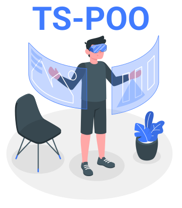

  

## Programação Orientada a Objetos com Typescript

> Repositório de estudos sobre conceitos básico da POO

 

## 📖 Contéudo estudado
- Abstração
- Herança
- Encapsulamento
- Polimorfismo

## 💻 Tecnologias:
- Typescript